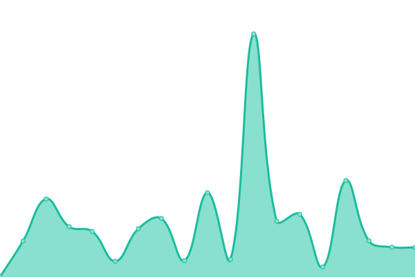

# [📈 Live Status](https://hap_adong.github.io/upptime): <!--live status--> **🟧 Partial outage**

This repository contains the open-source uptime monitor and status page for [hap_adong](https://hap_adong.github.io/upptime), powered by [Upptime](https://github.com/upptime/upptime).

With [Upptime](https://upptime.js.org), you can get your own unlimited and free uptime monitor and status page, powered entirely by a GitHub repository. We use [Issues](https://github.com/hap_adong/upptime/issues) as incident reports, [Actions](https://github.com/hap_adong/upptime/actions) as uptime monitors, and [Pages](https://hap_adong.github.io/upptime) for the status page.

<!--start: status pages-->
<!-- This summary is generated by Upptime (https://github.com/upptime/upptime) -->
<!-- Do not edit this manually, your changes will be overwritten -->
<!-- prettier-ignore -->
| URL | Status | History | Response Time | Uptime |
| --- | ------ | ------- | ------------- | ------ |
|  [Google](https://www.google.com) | 🟩 Up | [google.yml](https://github.com/hapadong/upptime/commits/HEAD/history/google.yml) | 

 137ms
     
 | 

<a href="https://hapadong.github.io/upptime/history/google">100.00%</a>
    

|  [Wikipedia](https://en.wikipedia.org) | 🟩 Up | [wikipedia.yml](https://github.com/hapadong/upptime/commits/HEAD/history/wikipedia.yml) | 

 249ms
     
 | 

<a href="https://hapadong.github.io/upptime/history/wikipedia">100.00%</a>
    

|  [Hacker News](https://news.ycombinator.com) | 🟩 Up | [hacker-news.yml](https://github.com/hapadong/upptime/commits/HEAD/history/hacker-news.yml) | 

 329ms
     
 | 

<a href="https://hapadong.github.io/upptime/history/hacker-news">99.59%</a>
    

|  [Carefolio Health](https://www.carefoliohealth.com) | 🟥 Down | [carefolio-health.yml](https://github.com/hapadong/upptime/commits/HEAD/history/carefolio-health.yml) | 

 676ms
     
 | 

<a href="https://hapadong.github.io/upptime/history/carefolio-health">97.26%</a>
    

|  [TXMSDG](https://www.txmsdg.org) | 🟩 Up | [txmsdg.yml](https://github.com/hapadong/upptime/commits/HEAD/history/txmsdg.yml) | 

 509ms
     
 | 

<a href="https://hapadong.github.io/upptime/history/txmsdg">99.10%</a>
    

|  [Vellum Privacy & Terms](https://hapadong.github.io/vellum) | 🟩 Up | [vellum-privacy-and-terms.yml](https://github.com/hapadong/upptime/commits/HEAD/history/vellum-privacy-and-terms.yml) | 

 170ms
     
 | 

<a href="https://hapadong.github.io/upptime/history/vellum-privacy-and-terms">100.00%</a>
    

|  [Cloudfare](https://www.cloudflare.com) | 🟩 Up | [cloudfare.yml](https://github.com/hapadong/upptime/commits/HEAD/history/cloudfare.yml) | 

 453ms
     
 | 

<a href="https://hapadong.github.io/upptime/history/cloudfare">100.00%</a>
    

|  [Youtube](https://youtube.com) | 🟩 Up | [youtube.yml](https://github.com/hapadong/upptime/commits/HEAD/history/youtube.yml) | 

 419ms
     
 | 

<a href="https://hapadong.github.io/upptime/history/youtube">100.00%</a>
    

|  [Test Broken Site](https://thissitedoesnotexist.koj.co) | 🟥 Down | [test-broken-site.yml](https://github.com/hapadong/upptime/commits/HEAD/history/test-broken-site.yml) | 

 0ms
     
 | 

<a href="https://hapadong.github.io/upptime/history/test-broken-site">100.00%</a>
    

|  [IPv6 test](forwardemail.net) | 🟥 Down | [i-pv6-test.yml](https://github.com/hapadong/upptime/commits/HEAD/history/i-pv6-test.yml) | 

 0ms
     
 | 

<a href="https://hapadong.github.io/upptime/history/i-pv6-test">100.00%</a>
    

<!--end: status pages-->

[**Visit our status website →**](https://hap_adong.github.io/upptime)

## 📄 License

- Powered by: [Upptime](https://github.com/upptime/upptime)
- Code: [MIT](./LICENSE) © [Anand Chowdhary](https://anandchowdhary.com), supported by [Pabio](https://pabio.com)
- Data in the `./history` directory: [Open Database License](https://opendatacommons.org/licenses/odbl/1-0/)
